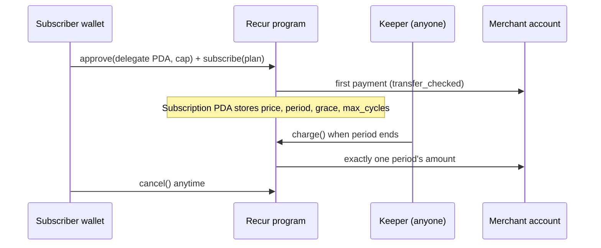

# Recur

**Stripe Billing for USDC on Solana.** Non-custodial subscriptions: customers approve once from their own wallet,
payments are collected on schedule, and anyone can cancel from any wallet.

- Hosted checkout and Blinks for every plan
- Merchant dashboard: MRR, 30-day forecast, at-risk payments, subscriber table, CSV export
- Access API (`is this wallet paid up?`) and signed webhooks
- Permissionless keeper: no single point of failure

## How it works



SPL Token allows one delegate per token account, so Recur uses a single program-wide delegate PDA and enforces
each subscription's limits in the program. The approval is recomputed from on-chain state on every subscribe
and cancel, so one wallet can hold many subscriptions.

Guarantees enforced on-chain: price locked at signup, at most one charge per period, no back-billing after a
lapse, funds only go to the merchant's own account, cancel by subscriber or merchant. See [SECURITY.md](SECURITY.md).

## Repository

```
programs/recur      Anchor 1.2 program
packages/sdk        TypeScript SDK (@solana/kit): instructions, accounts, flows, keeper
apps/web            Next.js 16: landing, dashboard, checkout, subscriber portal, API, Blinks
apps/keeper         Long-running keeper service
tests               LiteSVM tests (12)
scripts             devnet seeding, local end-to-end run
docs                pitch kit, webhooks, merchant outreach
```

## Quickstart

```bash
npm install
anchor build && npm test                 # 12 passing
cp apps/web/.env.example apps/web/.env.local
npm run dev                              # http://localhost:3000, demo at /dashboard?demo=1
```

Deploying to devnet, seeding plans, running the keeper and going live on Vercel: [MANUAL.md](MANUAL.md) (in Russian).

### End-to-end on a local validator

```bash
solana-test-validator --reset --bpf-program <PROGRAM_ID> target/deploy/recur.so
node --import tsx scripts/e2e-local.ts
```

## API

`GET /api/access?plan=<plan>&wallet=<wallet>` → `{ "active": true, "status": "active", "next_charge_at": 1761592000 }`

Webhook events and signature verification: [docs/webhooks.md](docs/webhooks.md).

## Roadmap

Protocol fee and cranker reward, free trials, plan upgrades with proration, subscriber reminders, Token-2022
support with extension checks, indexer-backed dashboard, external audit and multisig upgrade authority.

## License

MIT
